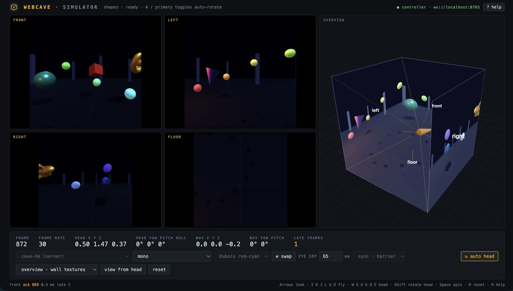

# WebCAVE

Browser-based cluster rendering for CAVEs, tiled display walls and other multi-screen immersive environments.



A **Manager** owns the clock, the frame counter, the tracked head pose and the navigation. Each display is driven by a **Node**, a browser window that receives the frame state, renders its screen with an off-axis (head-tracked) projection and acknowledges. A **Simulator** runs the whole cluster in one page on a laptop, or connects to a live Manager as a controller that mirrors and drives the real cluster. The same code runs in all of them.

## Features

- CAVE and tiled-wall installations described in JSON, by screen corners or by placement, with a generated schema
- Off-axis projection per screen from a head position; navigation moves the CAVE through the virtual world
- Frame barrier synchronization between Manager and Nodes, with a loose mode fallback
- Stereo output packing: mono, side-by-side, top-bottom, row, column and checkerboard interleaved, red-cyan anaglyph (Dubois and black-and-white), frame-sequential (experimental)
- Applications behind a minimal contract, one folder each, auto-discovered, as three.js scenes, raw WebGL programs, WebGPU programs or 2D views: animated shapes, glTF models, OpenVDB volumes and point clouds decoded in the browser, MapLibre maps spread across a wall with a shared interactive camera (3D buildings, a choropleth, clustered earthquakes with donut charts, a deck.gl dot-density map of Toronto driven from a control panel), the WebGL Aquarium swimming through the CAVE, WebGPU metaballs in a dungeon, the Hacker News front page as a reading room of cards (HTML-in-canvas when the browser has it), and a port of Crayoland, the original CAVE demo, with its bees, butterflies, grabbable flowers and soundscape
- Tracked head and wand in every frame, fed by a tracking bridge that speaks ART DTrack, OptiTrack NatNet and VRPN with a calibration into the CAVE frame; shared application state replicated by the Manager; input from keyboards, mice, gamepads and the wand's buttons through a device-independent action layer; one node designated as the sound output
- Application control panels: an app's sidebar runs on the simulator or a tablet page and drives the wall through shared state; the cluster switches applications live from the controller or a one-line command, no restart
- Multi-screen nodes placed with the Window Management API or kiosk Chrome
- Simulator with live stereo controls and a 3D overview of screens, head and frusta
- Headset viewer: the same application in a WebXR headset, standing inside the virtual CAVE and driven from the simulator on a laptop; the headset can also be the tracked head and its controller the wand

Not yet: Vicon DataStream, OSC and VMC trackers, a guided tracker calibration, WebGPU renderer, warp and blend, adapters for existing three.js or WebXR apps. Ideas for further applications are in [TODO.md](TODO.md).

## Quick start

Requires Node.js 20 or newer.

```sh
npm install
npm run dev
```

(The repository's `.npmrc` turns on `legacy-peer-deps`: the openvdb package declares a peer dependency on an older three.js than the project uses, which npm 7+ would otherwise refuse. Everything works with the newer one.)

Open <http://localhost:5173/simulator.html?config=cave-3m> for the simulator, or `?config=wall-3x1` for a display wall. Press `H` for the keys.

For a real cluster, start the Manager and open one node page per display:

```sh
npm run manager -- --config cave-3m
npm run tracker -- --config dtrack      # optional: head and wand from a tracking system
```

```
http://<host>:5173/node.html?node=front&manager=ws://<manager-host>:8765
```

## Documentation

- [Running](docs/running.md): simulator, keys, cluster mode, headset viewer, kiosk launch, multi-screen nodes, stereo modes
- [Deployment](docs/deployment.md): from a laptop to a one-PC CAVE to a full cluster, step by step; Docker images and a reverse proxy with a base path
- [Configuration files](docs/configuration.md): describing an installation in JSON
- [Input devices](docs/input.md): keyboard, mouse, gamepads, input on nodes
- [Tracking](docs/tracking.md): the tracking bridge for DTrack, NatNet and VRPN, calibration, wand buttons
- [Applications](docs/applications.md): the bundled apps and their options, a step-by-step guide to adding one, and notes on Crayoland, the OpenVDB and the MapLibre apps
- [Development notes](docs/development.md): technology, repository layout, frame protocol, testing tools
- [Specification](docs/SPECIFICATION.md): design document, research notes and roadmap

## Technology

TypeScript, Vite, three.js on WebGL2, WebSocket transport, zod for configuration, MapLibre GL JS and deck.gl for maps, in-house OpenVDB decoders, and WebGPU apps through an offscreen-canvas bridge. The Manager runs on Node.js.

## License

BSD 3-Clause, see [LICENSE](LICENSE). Third-party assets keep their own terms: the Damaged Helmet model is CC BY 4.0 (see `public/models/README.md`), map tiles come from OpenFreeMap with OpenStreetMap data (attribution required), and the sample volumes in `public/volumes/` are local files not included in the repository.

Crayoland, its crayon drawings, sounds and world data in `public/crayoland/`, are by Dave Pape and the Electronic Visualization Laboratory, University of Illinois at Chicago (1995), and remain theirs; they are included for the port and are not covered by this repository's license (see `public/crayoland/README.md`).

## Trademarks

CAVE (Cave Automatic Virtual Environment) and its successor, CAVE2, are registered trademarks owned by the Board of Trustees of the University of Illinois.
