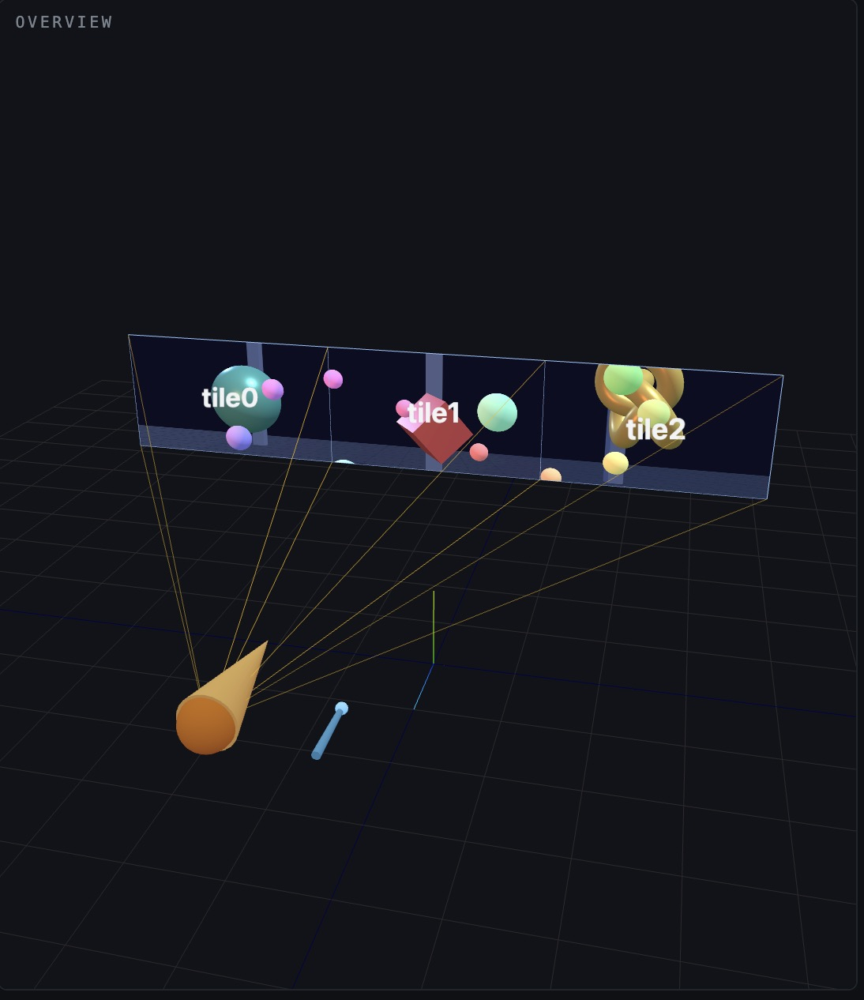
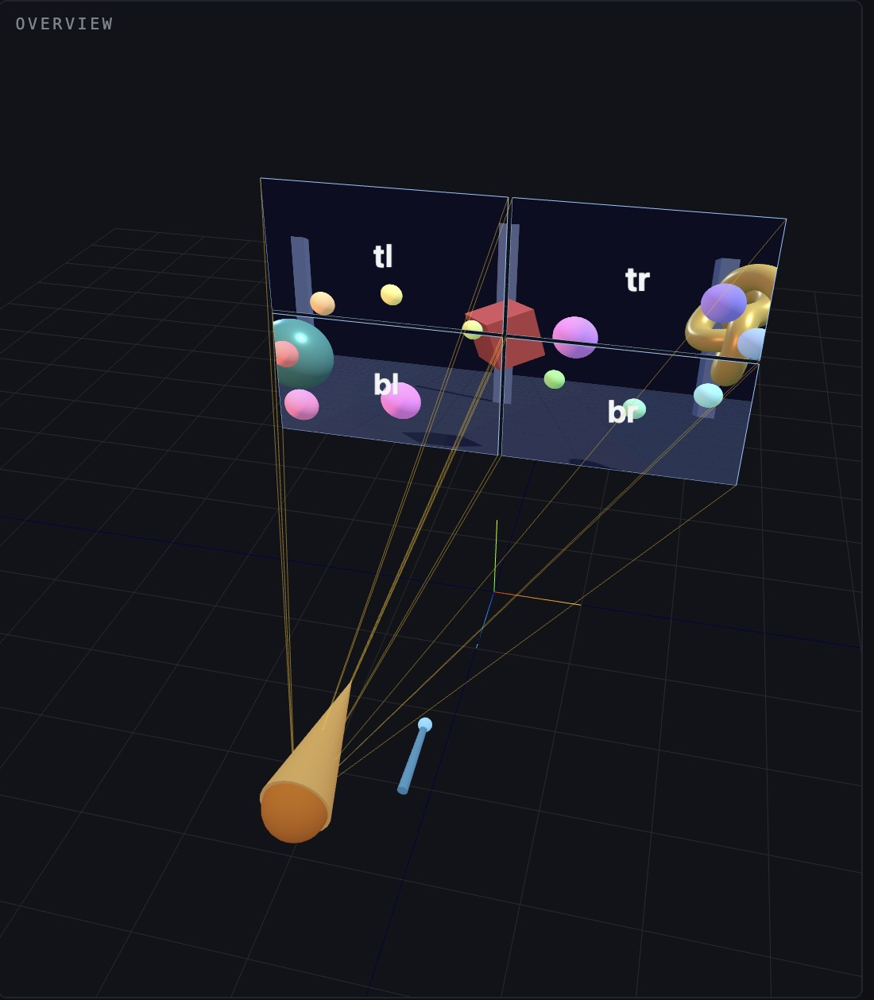
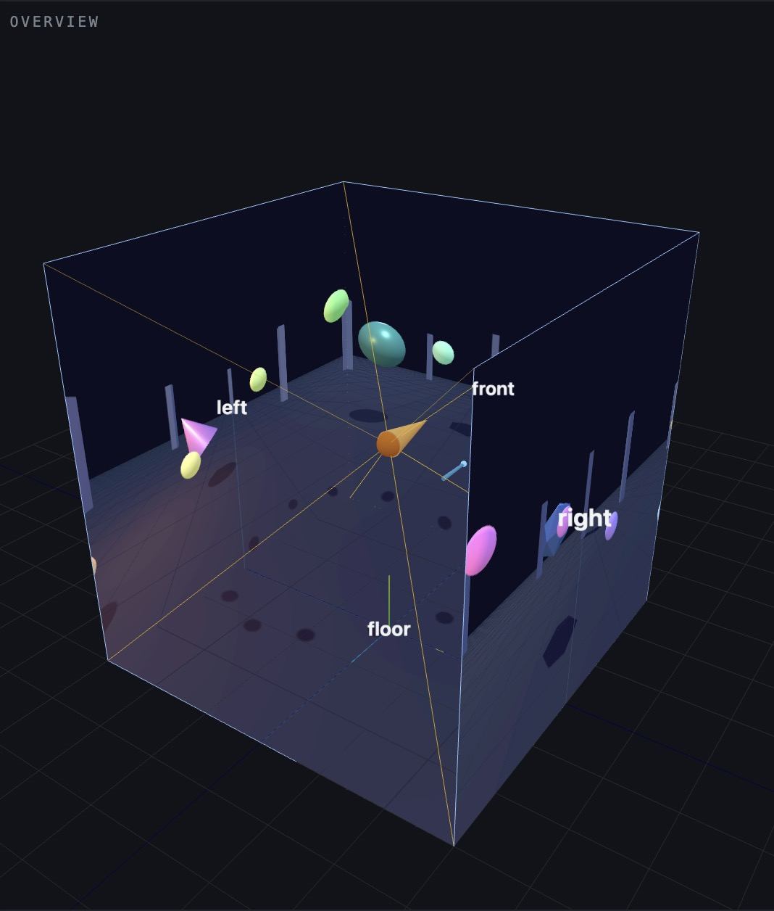
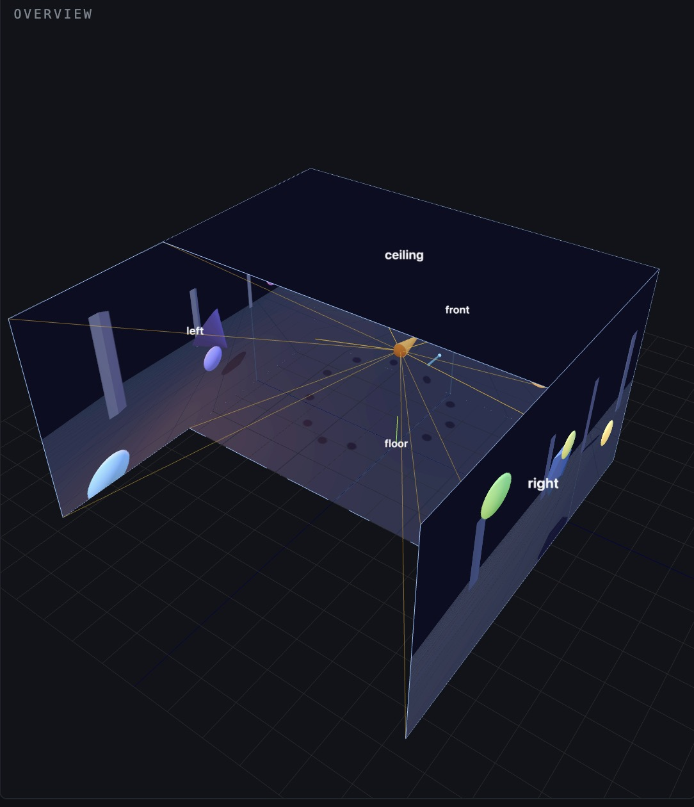
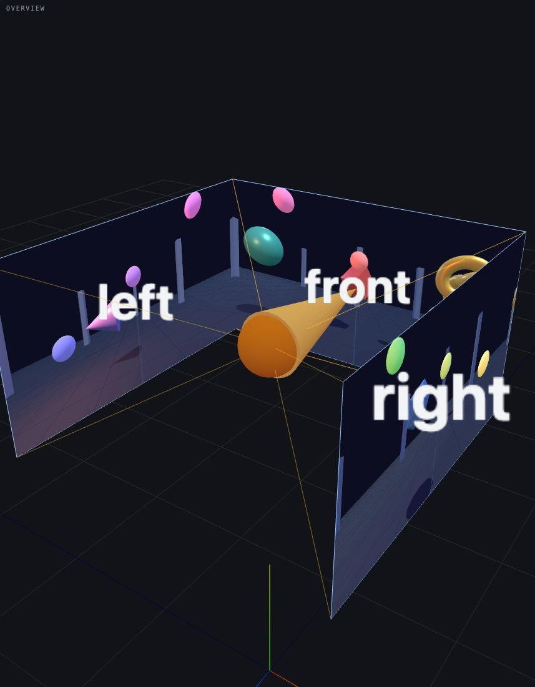

# Configuration files

An installation is a JSON file in `configs/`. The Manager loads it by name (`--config cave-3m`) or by path, the simulator lists the bundled ones in its dropdown, and every file carries `"$schema": "./schema.json"` so VS Code and other editors autocomplete and validate it. Copy one and edit it.

| File | What it describes |
|---|---|
| `cave-3m.json` | 3 m CAVE, four screens, one computer per screen |
| `cave-3m-1pc.json` | The same CAVE from one computer with four displays |
| `cave.json` | A 5.3 × 3 m room: front, left and right walls, floor and ceiling, one computer per screen |
| `head-cave.json` | Head-sized CAVE: three 46-inch Planar Clarity Matrix G3 MX46X panels (front, left, right) in landscape, bottom edge 40 in off the floor, one computer |
| `wall-3x1.json` | Three 16:9 tiles side by side |
| `wall-2x2.json` | Four 16:9 tiles with 2 cm bezels, runs the map app by default |
| `example-measured.json` | Template using measured corners and a per-screen stereo override |
| `schema.json` | Generated JSON Schema; regenerate with `npm run schema` after changing the types |

The simulator's overview draws each configuration as the room it describes, with the head (orange cone), the wand (blue stick) and the frusta from the head through every screen. In "scene in space" mode the application shows through the screens:

| | |
|---|---|
|  `wall-3x1.json` |  `wall-2x2.json` |
|  `cave-3m.json` |  `cave.json` |
|  `head-cave.json` | |

## Screens

A screen can be written two ways. By placement, for quick descriptions:

```json
{ "id": "left", "center": [-1.5, 1.5, 0], "width": 3, "height": 3, "yaw": 90, "widthPx": 1920, "heightPx": 1920 }
```

The screen starts facing the viewer at +z, centered at `center`. `yaw` turns it about the vertical axis in degrees (90 makes a left wall facing +x, -90 a right wall), `pitch` tilts it (-90 for a floor), `roll` turns it about its normal. Or by three measured corners in meters, lower-left `pa`, lower-right `pb`, upper-left `pc`:

```json
{ "id": "front", "pa": [-1.5, 0, -1.5], "pb": [1.5, 0, -1.5], "pc": [-1.5, 3, -1.5], "widthPx": 1920, "heightPx": 1920 }
```

Units are meters and degrees in a Y-up, right-handed frame with the physical floor at y = 0 and the viewer near the origin.

## Nodes

A node is a computer running one browser window per screen it lists. `"input": true` lets that node's keyboard, mouse and gamepads steer the cluster (see [input.md](input.md)); `"audio": true` makes it the sound output for applications that have sound (the machine wired to the speakers; exactly one node should have it, and on a multi-screen node only the window of the first listed screen plays). Both are off by default.

```json
{ "id": "pc", "screens": ["front", "left", "right", "floor"], "input": true, "audio": true }
```

## Defaults and validation

Everything except `name`, `screens` and `nodes` has a default: `fps` 60, `sync` barrier, `defaultHead` at (0, 1.6, 0), `defaultWand` as a hand offset from the head of (0.15, −0.45, −0.5) in the head's yaw frame, pointing forward, mono stereo, the shapes app. A screen may override stereo settings, for instance a passive wall whose odd column needs `"firstEye": "right"`. The `app` object selects the application and its options (see [applications.md](applications.md)).

Validation errors name the field: `npm run schema` checks all files, and the Manager refuses to start on an invalid one and prints why.

The file format lives in `src/core/configFile.ts` as a zod schema; the runtime types are in `src/core/config.ts`.
