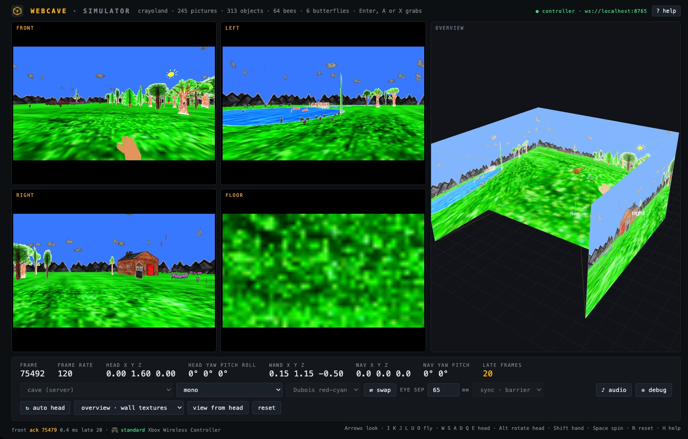

# Running WebCAVE

Requires Node.js 20 or newer. This page explains each piece; [deployment.md](deployment.md) walks through complete setups, from a laptop to a cluster.

```sh
npm install
npm run dev        # Vite dev server on http://localhost:5173
```

Other scripts: `npm run build`, `npm run preview`, `npm run typecheck`, `npm run schema` (validate and regenerate the config schemas), `npm run nodes` (kiosk launcher, below), `npm run tracker` (tracking bridge, see [tracking.md](tracking.md)).

## Simulator



*The simulator connected to a running Manager as a controller, mirroring a four-screen CAVE that runs the Crayoland application; an Xbox controller is driving it (footer). Crayoland and its crayon drawings are by Dave Pape, Electronic Visualization Laboratory, University of Illinois at Chicago (1995), used here with the port; see `public/crayoland/README.md`.*

No server needed: open <http://localhost:5173/simulator.html?config=cave-3m> or `?config=wall-3x1`. The config dropdown lists every file in `configs/`. The toolbar controls stereo mode, anaglyph scheme, IPD, eye swap, sync tier and the overview. The head starts at the config's default position and is moved with the keys below; the **auto head** button (or `?autohead=1`) replaces it with a simulated sway, handy for checking stereo and off-axis projection without touching the keyboard.

| Keys | Action |
|---|---|
| Arrow keys | Navigation look: yaw left/right, pitch up/down |
| `I` `K` / `J` `L` / `U` `O` | Fly forward/back, strafe left/right, down/up |
| `R` | Reset navigation and the head pose (position and orientation) |
| `Space` | Pause or resume the application's rotation on every screen (through the shared app state) |
| Gamepad | Left stick move, right stick look, triggers fly up/down, bumpers look up/down, d-pad moves the hand, Y toggles rotation, Back resets; see [input.md](input.md) |
| `Enter` / `Backspace` | Application buttons primary / secondary, same as gamepad A / B |
| `W` `S` / `A` `D` / `Q` `E` | Move the head: forward/back, left/right, down/up (not while auto head is on) |
| `Alt` + the same keys | Rotate the head: pitch, yaw, roll |
| `Shift` + `W` `S` / `A` `D` / `Q` `E` | Move the wand (the hand) relative to the head; `Shift` + `Alt` + `W S A D` pitch and yaw it |
| Mouse on a tile (3D apps) | Drag to look, right-drag to pan, wheel to fly, double-click to reset |
| Mouse drag on overview | Orbit the 3D overview |
| `H` or `?` | Toggle the keyboard help overlay (`Esc` closes; `?help=1` opens it at load) |

The head moves the viewer inside the physical CAVE and changes each screen's off-axis frustum. Navigation moves the whole CAVE through the virtual world, which is how you look up, down or turn. URL parameters set the initial navigation: `?yaw=30&pitch=20&x=0&y=0&z=-2` (degrees and meters).

The wand is the hand-held tracked controller. Its pose is part of every frame like the head's, shown as a stick in the overview and in the readout; applications use it to point and grab (Crayoland draws a hand there). Its buttons are the ordinary input actions: `Enter` or gamepad A is the primary button. Without a tracker the wand behaves like a hand: half a meter ahead of the head and below the eyes, following the head's position and yaw but not its pitch, so looking down does not move it. The simulator's `Shift` keys and the gamepad's d-pad (on the simulator or an input node) adjust that offset. With a tracking system, the [tracking bridge](tracking.md) replaces both head and wand with the measured poses.

The head and wand keys are matched by physical key, so they work whatever the modifier makes of the letter, and they avoid `Ctrl`, which Chrome reserves on Windows and Linux (`Ctrl+W` closes the tab). `Alt` plus a letter would open Chrome's menu or focus the address bar there; the simulator swallows those events while it has focus.

The **audio** button (or `?audio=1`) makes the simulator the cluster's sound output for applications that have sound; only one window in a cluster should play. The button switches sound on and off without reloading for apps that support it. The **debug** button (or `?debug=1`) asks the application for its debug drawing the same way; Crayoland shows every object's pick sphere, the wand point and the touched object.

Applications with a control panel (`createPanel`, see [applications.md](applications.md)) get a third column next to the overview with their controls; the dot-density map is one. The same panel stands alone at <http://localhost:5173/panel.html?manager=ws://localhost:8765>, sized for a tablet.

### Overview panel

The **Overview** shows the physical installation: screens, frusta, the head as a sphere with a cone whose tip points in the viewing direction, and the wand as a stick with a bright tip. Its content mode is selectable in the toolbar or with `?overview=`:

- `none`: geometry only
- `walls`: each screen shows a mono render of what that wall displays, a "virtual CAVE" preview. The tiles show the actual stereo-packed output.
- `world`: the virtual scene is drawn in space around the CAVE, placed by the navigation transform, useful when debugging interaction with objects

"View from head" moves the overview camera to the eye position, where the wall images should join seamlessly.

### Switching applications

The **application dropdown** in the toolbar, next to the config, lists every app in the build. Standalone, choosing one reloads the page with `?app=`. As a controller of a live Manager it sends `setApp`, and the whole cluster switches: the Manager replaces the config's app, clears the shared application state and resets the navigation, and every connected page rebuilds for the new app when it sees it in the next frame, nodes in place, the simulator by reloading, the panel page by mounting the new panel, the headset viewer in its session. Nothing restarts and no URL changes. The same switch from a shell:

```sh
npm run set-app -- ws://manager-host:8765 crayoland
npm run set-app -- ws://manager-host:8765 gltf model=/models/DamagedHelmet.glb size=1
```

A page with its own `?app=` override keeps that app regardless (it is for testing one screen).

### Simulator as controller

Point the simulator at a running Manager and it stops running its own. The picture at the top of this page shows this mode: the header reads "controller · ws://localhost:8765", the config selector shows the server's config greyed out, and the late-frame counter reports the real cluster's barrier. It receives the same frames as the Nodes, mirrors the wall in its tiles and overview, and its keyboard, gamepad and toolbar drive the cluster's head and navigation.

```
http://localhost:5173/simulator.html?manager=ws://localhost:8765
```

The config and sync tier then come from the server and are shown disabled in the toolbar. The controller never acks frames, so it cannot hold the cluster barrier.

### Headset viewer (WebXR)

The scene can also be looked at from inside a VR headset while the simulator on a laptop drives the cluster. Start a Manager, open the simulator as its controller, and open the headset page on the headset's browser:

```sh
npm run manager -- --config cave-3m --app gltf
```

```
http://<laptop>:5173/simulator.html?manager=ws://<laptop>:8765      # on the laptop
http://<laptop>:5173/xr.html?manager=ws://<laptop>:8765             # on the headset, then "Enter VR"
```

The headset page joins as a controller (it mirrors the frames and never holds the barrier), runs the same application and renders its scene into an immersive WebXR session. The headset's eye views replace the CAVE screens: the XR floor origin is placed at the CAVE origin, so the wearer stands inside the virtual CAVE, and the navigation you fly from the simulator carries them through the world. Before a session starts, and on a laptop, the page shows a mono preview from the cluster's tracked head. Scene apps and raw WebGL apps render in the headset; flat and WebGPU apps do not.

WebXR needs a secure context. The Meta Quest browser and other headsets only run it from `https://` or `localhost`, so either run the dev server with a self-signed certificate, `npm run dev:https` (accept the certificate once on the headset; the page then reaches the Manager through the dev server at `wss://<laptop>:5173/manager`, since a secure page cannot open a plain `ws://` socket), or, for a Quest on USB, forward the ports with `adb reverse tcp:5173 tcp:5173` and `adb reverse tcp:8765 tcp:8765` and open `http://localhost:5173/xr.html` on the headset.

Options on the URL:

| Parameter | Effect |
|---|---|
| `head=1` | Publish the headset pose as the CAVE head every frame, so the wall screens' off-axis projections follow the wearer (the simulated head switches off) |
| `origin=x,y,z`, `yaw=deg` | Where the headset's floor origin sits in the CAVE frame, and its rotation about the vertical axis |
| `input=0` | Do not send the XR controllers as input |
| `polyfill=1` | Use the WebXR polyfill's Cardboard device: a phone in a cardboard viewer, or a stereo test on a laptop |
| `app=`, `model=`, ... | Application overrides, as on a node |

With input on, the right XR controller is the wand: its pose is published absolutely in the CAVE frame like a tracked wand, the trigger is the primary button (A), the grip is X (grab in Crayoland), A and B on the controller are the secondary and quaternary buttons, and the right thumbstick moves while the left one looks; X on the left controller toggles spin and Y resets. The mapping goes through the same action layer as gamepads, so applications need no headset-specific code.

## Cluster mode

Start the Manager, then open one Node page per display.

```sh
npm run manager                       # ws://localhost:8765, default CAVE config
npm run manager -- --config wall-3x1 --sync loose --port 8765
npm run manager -- --config path/to/my-cave.json
npm run manager -- --list-configs
npm run manager -- --app gltf --model /models/DamagedHelmet.glb --size 0.8 --spin 0.3
```

```
http://<dev-host>:5173/node.html?node=front&manager=ws://<manager-host>:8765
http://<dev-host>:5173/node.html?node=left
http://<dev-host>:5173/node.html?node=right&stereo=anaglyph
```

Click a Node, or press `f`, `Enter` or `Space`, to go fullscreen; press `h` to hide the HUD. Parameters: `node` (node id), `view` (which of the node's screens, for multi-screen nodes), `screen` (display index for fullscreen), `stereo` (override the output mode), `manager`, `input=1` (take input on this window, see [input.md](input.md)), `audio=1` (this window plays the application's sound; the config's `audio: true` on the node is the proper switch), and the application overrides listed in [applications.md](applications.md).

The application is part of the cluster config, so every Node runs the same one. Set it in the config file or with `--app` and its options on the Manager.

## Fullscreen nodes without clicking

A page cannot put itself fullscreen: browsers only honour `requestFullscreen` inside a user gesture, so there is no URL parameter for it. For an installation, start the browser itself in kiosk mode. The launcher opens one independent kiosk Chrome per node, each with its own profile, positioned on its display:

```sh
npm run nodes                                                  # front, left, right, floor, laid out left to right
npm run nodes -- --nodes tile0,tile1,tile2 --positions "0,0 1920,0 3840,0"
npm run nodes -- --nodes left --server http://192.168.1.10:5173 --manager ws://192.168.1.10:8765
npm run nodes -- --stereo anaglyph --width 2560 --height 1440
npm run nodes -- --kill                                        # stop them all
```

Positions are the top-left pixel of each display in the OS's virtual desktop, as shown in the display settings. Run `scripts/launch-nodes.sh --help` for all options, including `--chrome PATH` when the browser is not found. The script is bash and works on macOS and Linux; on Windows use the same flags on `chrome.exe`:

```
chrome.exe --kiosk --user-data-dir=%TEMP%\webcave-front --window-position=0,0 --window-size=1920,1080 --app="http://host:5173/node.html?node=front&manager=ws://host:8765"
```

Kiosk Chrome also needs no gesture for WebGL, but it must be able to reach the page server and the Manager, so on a multi-machine cluster pass their addresses rather than `localhost`.

## One computer, several displays

A node in the config can list several screens, for example `configs/cave-3m-1pc.json` has one node `pc` driving front, left, right and floor. Each screen is still one browser window, opened on its display with `node=pc&view=front`, `node=pc&view=left` and so on. Three ways to place them:

1. **Launcher page** (Chrome or Edge): `http://localhost:5173/launcher.html?node=pc`. It reads the config from the Manager, enumerates the displays with the Window Management API, lets you map each screen to a display, and opens all windows in one click. With the window-management permission granted, the windows open directly fullscreen on their display. It also prints the equivalent kiosk command with the detected display positions filled in.
2. **Kiosk script** with `node:view` ids: `npm run nodes -- --nodes pc:front,pc:left,pc:right,pc:floor --positions "0,0 1920,0 3840,0 5760,0"`.
3. **By hand**: open each node URL, add `&screen=N` to name the display, and click once. The node page uses the Window Management API to go fullscreen on display N, and shows which display it landed on in its HUD.

The Window Management API only exists in secure contexts and prompts once for permission. `http://localhost` qualifies. Nodes on other machines must load the pages over https, or Chrome must be started with `--unsafely-treat-insecure-origin-as-secure=http://server:5173`. The kiosk script needs none of this.

## Stereo output

The output mode is set per cluster or per screen in the config file, in the simulator toolbar, or with `?stereo=` on a node or the simulator: `mono`, `side-by-side`, `side-by-side-half`, `top-bottom`, `top-bottom-half`, `row-interleaved`, `column-interleaved`, `checkerboard`, `anaglyph` (with `anaglyph=dubois` or `anaglyph=bw`), `frame-sequential` (experimental). The design and parameters of each mode are in the [specification](SPECIFICATION.md).

**Live from the controller.** The toolbar's stereo controls (mode, anaglyph scheme, eye separation, swap) are not only for the simulator's own tiles: each change is also sent to the Manager as `setStereo` and travels in every frame as `state.stereo`, so the real screens follow the toolbar while the cluster runs. A node applies the live settings over its config's stereo for that screen and re-fits its canvas when the packing changes; a `?stereo=` override on the node's own URL still wins for the mode. The settings are not saved: they last until the Manager restarts, and the config file remains the place for permanent values.
